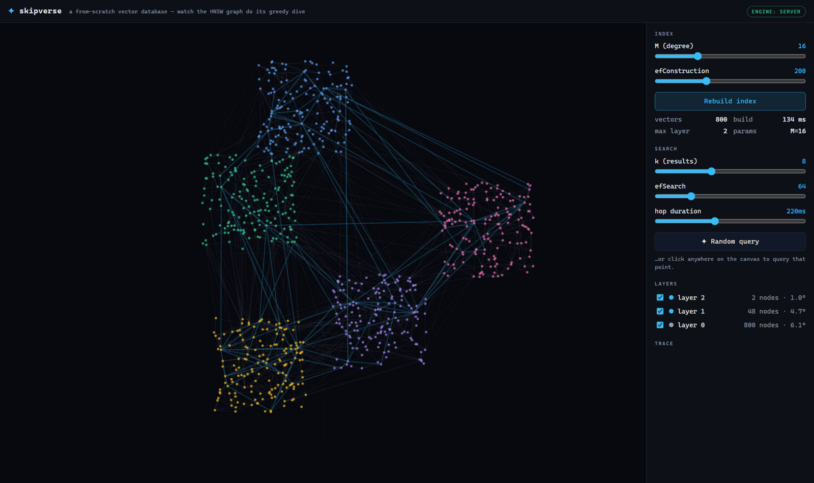
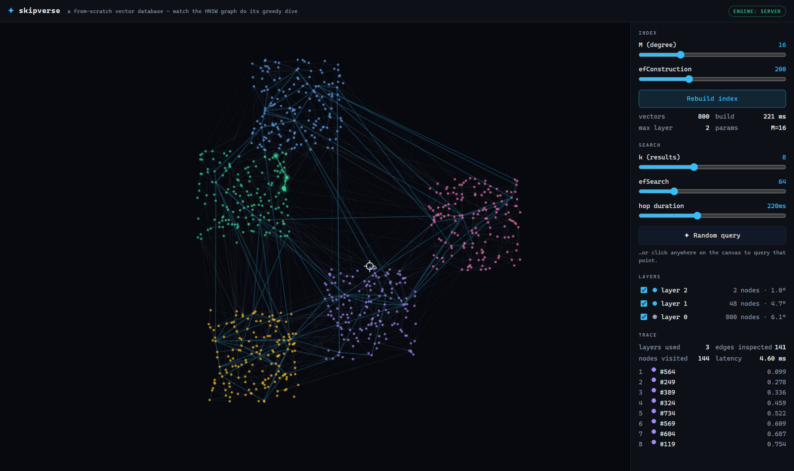
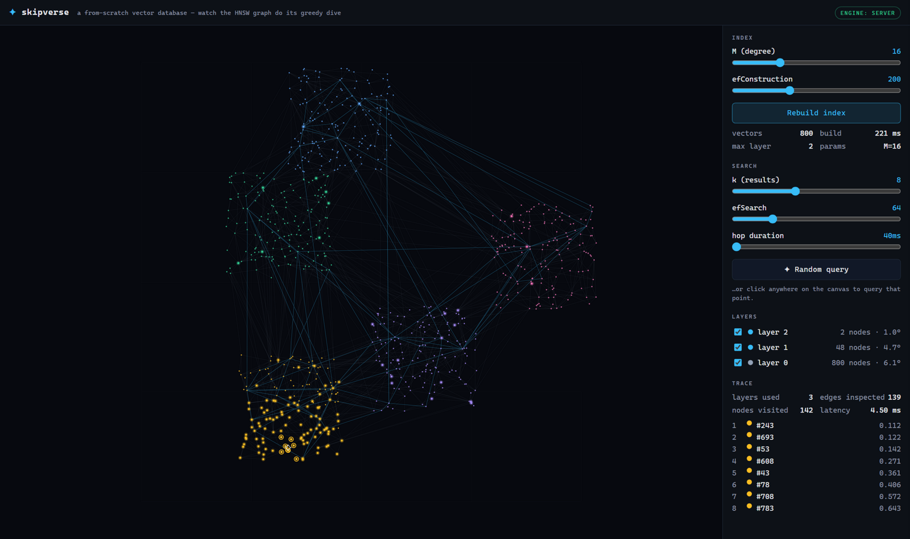
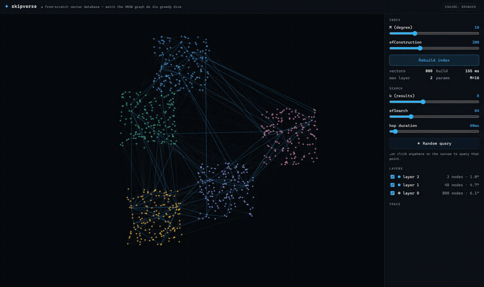

# ✦ skipverse

**A vector database written from scratch — HNSW graph index, crash-safe WAL, deterministic replay, and a living visualization of every greedy hop.**

[](https://github.com/qiyuhuating/skipverse/actions/workflows/ci.yml)
[](https://qiyuhuating.github.io/skipverse/)
[](#zero-dependencies)
[](LICENSE)

| the graph | the search | the answer |
|---|---|---|
|  |  |  |

*The demo is the same engine that ships on npm — running in your browser. Watch the green token dive through layers 2 → 1 → 0, then the gold rings light up the top-k. [Live demo →](https://qiyuhuating.github.io/skipverse/)*



---

## Why from scratch

Vector search powers every embedding-based system, yet the core algorithm —
[HNSW](https://arxiv.org/abs/1603.09320) (Malkov & Yashunin, 2016) — is usually swallowed by a dependency. skipverse
implements the whole stack by hand, in ~1,450 lines of strict TypeScript with **zero runtime dependencies**:

- **multi-layer navigable small world graph** — exponential layer assignment, greedy descent through sparse upper
  layers, ef-bounded beam search on the dense layer 0;
- **diversity-aware neighbor selection** (paper's Algorithm 4, `keepPruned=false`) so hubs don't eat the graph;
- **durability the honest way** — CRC-32 framed WAL, torn-write recovery, atomic snapshot checkpoints, op-sequence
  replay;
- **determinism** — layer assignment is seeded from a hash of the vector id plus the insertion counter, so replaying
  the same op stream rebuilds a byte-identical graph (and the tests rely on it);
- **one isomorphic core** — the same `HnswIndex` class serves HTTP traffic on Node and renders this README's demo in
  the browser.

## Quickstart

### Embed it

```ts
import { HnswIndex } from "skipverse";

const idx = new HnswIndex({ dim: 64, metric: "cosine", M: 16, efConstruction: 200 });
idx.add("doc-1", embedding);
idx.add("doc-2", embedding);

const hits = idx.search(query, 10, { ef: 64 });
// [{ id: "doc-42", dist: 0.113 }, ...]
```

### Persist it

```ts
import { VectorStore } from "skipverse";

const store = VectorStore.open({ dataDir: "./data", dim: 64, metric: "cosine" });
store.upsert("doc-1", embedding);        // appended to CRC-framed WAL, auto-checkpointed
store.remove("doc-2");                   // soft delete: filtered from results, kept as graph anchor
store.checkpoint();                      // atomic snapshot + WAL truncation
// kill -9 at any point: reopen replays the WAL, torn tails are truncated at frame boundaries
```

### Serve it

```bash
git clone https://github.com/qiyuhuating/skipverse && cd skipverse
npm install && npm run build
npx skipverse serve --port 8787 --dim 64 --metric cosine
```

```bash
curl -X POST localhost:8787/vectors -H 'content-type: application/json' \
     -d '{"vectors":[{"id":"a","vec":[0.1,0.2, ...]}]}'

curl -X POST localhost:8787/search \
     -d '{"vec":[0.1,0.2, ...],"k":8,"ef":64,"trace":true}'
```

### Watch it

```bash
git clone https://github.com/qiyuhuating/skipverse && cd skipverse
npm install && npm run serve     # → http://localhost:8787
```

## Filter, compact, quantize

**Filtered search** — hnswlib semantics: filtered-out nodes are still traversed (the graph stays connected) but never
occupy the result beam, so the whole `ef` budget is spent on admissible nodes. Raise `ef` when the filter is very
selective.

```ts
const hits = idx.search(q, 10, { ef: 128, filter: (id) => tenantOf(id) === "acme" });
```

**Compaction** — deletes are tombstones: dead nodes stay as traversal anchors until you reclaim them.

```ts
store.compact();   // deterministic rebuild from alive vectors + atomic snapshot rotation
```

**SQ8 scalar quantization** — the faiss/hnswlib "train once, serve" model: insert in f32, calibrate once, every
stored vector becomes one byte per dimension (4× smaller); distances then run in register-dequantized space.

```ts
const idx = new HnswIndex({ dim: 64, metric: "euclidean", quantization: "sq8" });
// ... add() your corpus in f32 ...
idx.calibrate();     // freezes per-dimension [min,max], rewrites vectors as u8 — one-shot
idx.add("new-doc", vec);   // later inserts are quantized through the frozen ranges
```

Under the hood the quantized kernels do real math, not byte-tricks. For **euclidean**, search uses *asymmetric
distance computation*: the query stays exact f32 (reduced to `v⊙step`, `v·min`, `‖v‖²`) and each pair costs one
dim-loop plus three scalars against the dequantized code. For **cosine/dot**, both sides are u8 codes evaluated via
the identity `v·v′ = q·W·q′ + c·q + c·q′ + K` (with `W = step²`, `c = step·min`, `K = Σmin²`) — one weighted dot plus
three precomputed scalars. The per-node aux scalars are pure functions of (codes, calibration), so they're rebuilt
on load instead of stored. Serialized as format v2 (u8 flag + calibration table); v1 indexes still load.

## The trace: search you can read

`trace: true` returns the full traversal, layer by layer — this is what the demo animates:

```json
{
  "results": [{ "id": "564", "dist": 0.089 }, ...],
  "trace": {
    "layers": [
      { "level": 2, "entry": "712", "hops": [{ "from": "712", "to": "709", "dist": 0.62 }], "visited": 2 },
      { "level": 1, "entry": "709", "hops": [ ... 11 more ... ], "visited": 12 },
      { "level": 0, "entry": "709", "hops": [ ... 139 hops ... ], "visited": 141 }
    ],
    "visitedTotal": 155
  }
}
```

On the 10k×64d benchmark, answering a query touches **~500 of 10,000 nodes** — the other 9,500 are never looked at.

## How it works

```
            entry                                        query
              │                                             │
   layer 2    │        7─────────9                          │  1. greedy descent: walk the sparse
              │      /           \                          │     upper layers toward the query's
   layer 1    │  48───────48───────48──                     │     neighborhood          O(log N)
              │  (beam widens: ef grows per layer)          │
   layer 0    │  800 nodes · degree ≤ 2M                    │  2. beam search ef nearest on the
              │  ~~~~~~~~~~~~~~~~~~~~~~~~~~~                │     dense bottom layer    O(M · ef)
              └─ every node lives on all layers ≤ its own   │  3. diversity-heuristic keeps links
                                                               spread out during insertion
```

**Insert** — sample the node's top layer from an exponential distribution, greedy-descend to it, then per layer:
ef-bounded search for candidates, Algorithm-4 selection of M diverse links, bidirectional connect, and re-select any
neighbor that overflowed its degree cap (M on upper layers, 2M on layer 0).

**Search** — greedy from the entry point down to layer 1, then a `max(ef, k)`-bounded beam on layer 0. `ef` is the
recall/latency knob: benchmark below.

**Delete** — soft: nodes stay as traversal anchors, are filtered from results, and vanish at the next snapshot
checkpoint. Hard deletes in a proximity graph are a research topic; this is the hnswlib-grade pragmatic answer, and
the store tracks `deleted` so compaction is observable.

**Durability** —

```
upsert ──► WAL frame [len | crc32 | seq | op | id | f32×dim] ──► fsync-less append (batch durability)
                │ crash mid-frame?
                ▼
reopen: CRC scan ──► longest valid prefix ──► truncate torn tail ──► replay ops with seq > snapshot.lastSeq
checkpoint: snapshot.tmp ──► atomic rename ──► WAL truncate
compact:   deterministic rebuild from alive vectors ──► tombstone space reclaimed
```

## Benchmarks

Deterministic, seeded, reproducible (`npm run bench`):

### skipverse 10,000 × 64d · M=16 · efConstruction=200 · euclidean · k=10

| mode | efSearch | recall@10 | QPS | avg nodes visited |
|:-----|---------:|----------:|----:|------------------:|
| f32 | 16 | 0.9650 | 13,696 | 288.9 |
| f32 | 64 | 1.0000 | 5,855 | 501.9 |
| f32 | 128 | 1.0000 | 3,562 | 571.1 |
| sq8 (ADC) | 16 | 0.9400 | 12,197 | 288.1 |
| sq8 (ADC) | 64 | 0.9720 | 5,078 | 502.1 |
| sq8 (ADC) | 128 | 0.9720 | 3,331 | 570.9 |
| brute force | — | 1.0000 | 420 | 10,000 |

build: f32 3.26s · sq8 3.39s (incl. calibration) · vector storage: f32 256 B/vec → sq8 64 B/vec (**4.0× smaller**).

Reading the table honestly: at ef=64 the f32 index is **~15× brute force at identical recall** (32× at ef=16).
Queries are in-distribution (data point + N(0, 0.3) noise) — deliberately off-manifold queries are the known weak
spot of greedy graph search, in this implementation and every other.

SQ8 trades a little accuracy for a lot of footprint: **4× smaller vectors at ~87% of the f32 QPS and −2.8 recall
points** at ef=64. The win comes from asymmetric distance computation — the query stays full-precision f32 and only
the stored side is a u8 code, which removes half the quantization noise (symmetric codes scored 0.864 on this
dataset before ADC; the residual plateau at 0.972 is the data-side noise). Tight gaussian blobs produce many
near-tie distances, exactly where 8-bit codes hurt most; spread-out distributions lose even less.

## Zero dependencies

`package.json` lists four **dev**Dependencies (typescript, tsx, esbuild, @types/node) and nothing else. The engine
uses `Math`, `DataView`, `Uint8Array`, and `node:fs` when on Node. That is deliberate: a database's trust boundary
should not include 200 transitive packages, and the algorithm is the product.

## Acceptance criteria (enforced by CI)

- 35+ tests green on Node 22 & 24 — including recall floors (f32 and sq8), degree-cap invariants, filtered-search
  semantics, WAL torn-write recovery, snapshot+WAL round-trips, compaction, and a full HTTP restart cycle;
- typecheck strict, `verbatimModuleSyntax`, no `any` in the engine;
- the CI benchmark run must hold **f32 recall@10 ≥ 0.95 and sq8 recall@10 ≥ 0.90 at ef=64** or the build fails.

## Roadmap

- [ ] SQ4/PQ residual refinement for memory-bound fleets
- [ ] online recalibration when the data distribution drifts
- [ ] concurrent readers (copy-on-write snapshot reads)
- [ ] memory-mapped snapshot loader (zero-copy warm start)
- [ ] WASM build of the core for CDN-drop usage

## License

[MIT](LICENSE) © 2026 qiyuhuating
